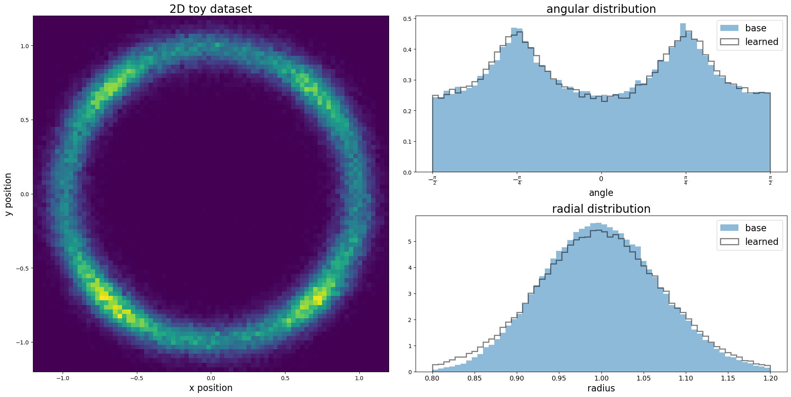
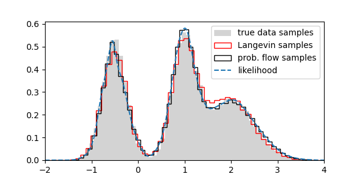

# Primer on diffusion models

Fully functional educational notebooks on diffusion models with fully functional code. It is a companion to a series of educational blogposts:

1. [AI with Smoluchowski](https://grelade.github.io/diffusion-pt1-ai-with-smoluchowski)
2. [Nano diffusion](https://grelade.github.io/diffusion-pt2-nano-diffusion/)
3. [Likelihoods](https://grelade.github.io/diffusion-pt3-likelihoods/)

## Notebook descriptions

* [nano-notebook.ipynb](nano-notebook.ipynb)
learns a simple diffusion model to generate a synthetic 2D dataset. Uses a minimal, vanilla feed-forward neural network. [details](https://grelade.github.io/diffusion-pt2-nano-diffusion/)

* [likelihood-notebook.ipynb](likelihood-notebook.ipynb)
learns a synthetic 1D dataset with the aim to obtain the data likelihood. [details](https://grelade.github.io/diffusion-pt3-likelihoods/)

